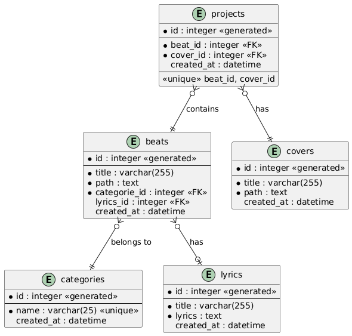

# API de Gestion de Projets Musicaux

## Description

L'api de gestion de projets musicaux est une application web permettant de gérer des projets musicaux en centralisant les instrumentales (beats), les paroles et les covers. L'application permet de télécharger des instrumentales depuis YouTube ou d'uploader vos propres fichiers, de gérer les paroles associées et d'organiser vos projets musicaux.

## Fonctionnalités

-   **Gestion des Beats (productions musicales)**

    -   Téléchargement d'instrumentales depuis YouTube
    -   Upload de fichiers audio personnels
    -   Analyse automatique du BPM
    -   Catégorisation des beats

-   **Gestion des Paroles**

    -   Création et édition de paroles
    -   Association des paroles aux beats
    -   Organisation par projet

-   **Gestion des Covers**

    -   Upload de covers pour les projets
    -   Association avec les beats et paroles

-   **Gestion des Projets**
    -   Création de projets musicaux complets
    -   Association beat + cover + paroles
    -   Organisation et catégorisation

## Modèle de données



### Description du modèle

Le modèle de données est structuré autour de cinq entités principales :

1. **Beats**

    - Entité centrale pour le stockage des instrumentales
    - Liée aux paroles (relation optionnelle)
    - Catégorisée pour une meilleure organisation
    - Stocke les métadonnées comme le BPM et le chemin du fichier

2. **Lyrics**

    - Stocke les paroles des chansons
    - Peut être associée à plusieurs beats
    - Contient le titre et le texte des paroles

3. **Categories**

    - Permet la classification des beats
    - Relation one-to-many avec les beats
    - Facilite l'organisation et la recherche

4. **Covers**

    - Gère les fichiers de couverture des projets
    - Stocke le titre et le chemin du fichier
    - Indépendante jusqu'à son association avec un projet

5. **Projects**
    - Entité d'association principale
    - Relie un beat à une cover
    - Représente un projet musical complet
    - Permet le suivi et l'organisation des productions

### Relations clés

-   Un beat peut avoir des paroles (0..1)
-   Un beat appartient à une catégorie (1..1)
-   Un projet associe exactement un beat et une cover (1..1)
-   Une cover peut être utilisée dans plusieurs projets
-   Une catégorie peut contenir plusieurs beats

## Installation

### Prérequis

-   Node.js (v14 ou supérieur)
-   npm ou yarn

### Étapes d'installation

1. Cloner le repository

```bash
git clone git@github.com:dotNacer/api-music.git
cd api-music
```

2. Installer les dépendances

```bash
npm install
```

3. Lancer l'application

```bash
npm run dev
```

L'application sera accessible à l'adresse `http://localhost:3000`

## Structure de l'API

### Endpoints principaux

-   `/api/beats` - Gestion des beats
-   `/api/lyrics` - Gestion des paroles
-   `/api/covers` - Gestion des covers
-   `/api/projects` - Gestion des projets
-   `/api/categories` - Gestion des catégories

La documentation complète de l'API est disponible à l'adresse `/api-docs` une fois l'application lancée.

## Choix Technologiques

### Backend

-   **Node.js & Express**: Choisis pour leur efficacité dans la gestion des opérations I/O asynchrones et leur grande communauté de développeurs.
-   **SQLite**: Base de données légère et sans serveur, parfaite pour une application de taille moyenne ne nécessitant pas de configuration complexe.

### Traitement Audio

-   **ytdl-mp3**: Bibliothèque optimisée pour le téléchargement de contenu YouTube et la conversion en MP3. Choisie pour :

    -   Sa gestion efficace du streaming
    -   Sa capacité à extraire uniquement l'audio
    -   Son support des différentes qualités audio
    -   Sa compatibilité avec les dernières modifications de l'API YouTube

-   **node-web-audio-api**: API native pour l'analyse audio, sélectionnée pour :
    -   Son implémentation des Web Audio API standards
    -   Sa capacité à analyser le BPM et les caractéristiques audio
    -   Sa performance dans le traitement audio côté serveur
    -   Son faible impact sur les ressources système

### Documentation

-   **Swagger UI**: Interface interactive pour la documentation API, facilitant les tests et l'intégration.

### Frontend

-   **HTML/CSS/JavaScript Vanilla**: Approche légère et performante, sans framework superflu pour une application de cette envergure.
